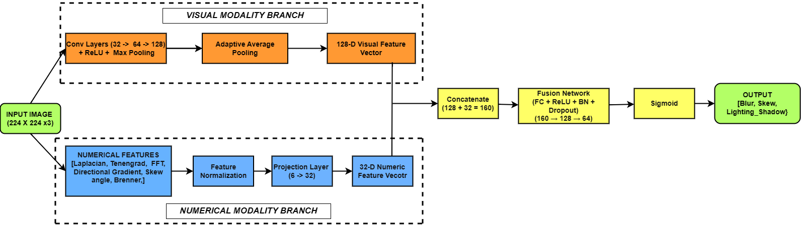
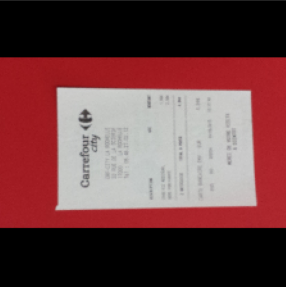
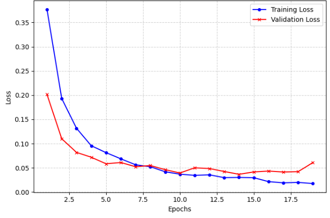
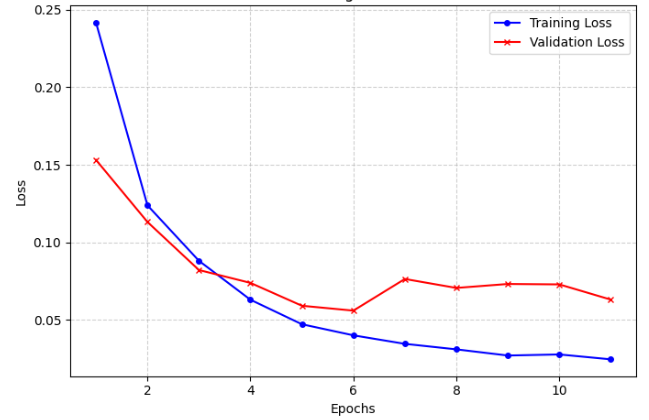
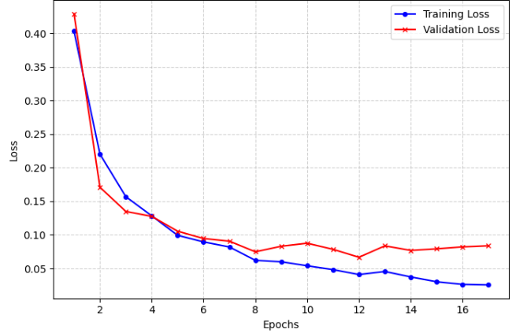
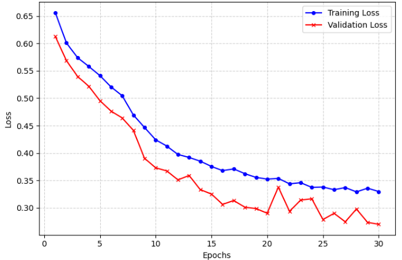
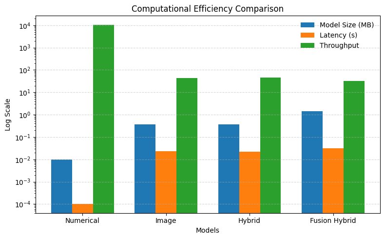

<div align="center">

# Lightweight Multimodal Fusion Framework for Multi-Label Document Image Quality Assessment

### Efficient Deep Learning Framework for OCR-Oriented Document Quality Analysis

</div>

---
> 📄 For a detailed explanation of the methodology, workflow, experiments, and results, please refer to the project PDF report included in this repository.

# Overview

Document Image Quality Assessment (DIQA) is a crucial preprocessing step in OCR and intelligent document processing systems. Poor-quality document images significantly affect OCR accuracy, readability, and downstream document understanding tasks.

This project proposes a **lightweight multimodal fusion framework** for **multi-label document image quality assessment**, combining image features and numerical quality features to improve classification performance while maintaining computational efficiency.

The work includes:
- Ablation studies
- Baseline image-only models
- Numerical feature baselines
- Pretrained lightweight architectures
- Comparative evaluation with existing approaches

---

# Framework Architecture

<div align="center">

</div>

<p align="center">
<b>Figure 3.</b> Proposed lightweight multimodal fusion framework architecture.
</p>

---

# Sample Document Images

<div align="center">

| Clean Document | Preprocessed Document |
|---|---|
|  |  |

</div>

---

# Repository Structure

```bash
├── diqa-ab-premobile-efficient.ipynb
├── diqa-imagebaeline-preresnet-existingwo....ipynb
├── figures/
│   ├── Figure_1.png
│   ├── Figure_2.png
│   ├── Figure_3.png
│   ├── Figure_4_a.png
│   ├── Figure_4_b.png
│   ├── Figure_4_c.png
│   ├── Figure_5.png
│   └── Figure_6.png
├── README.md
└── requirements.txt
```

---

# Notebook Descriptions

## 1. `diqa-ab-premobile-efficient.ipynb`

This notebook contains:

### Ablation Studies
- Ablation Model A
- Ablation Model B

### Proposed Final Multimodal Framework
- Lightweight multimodal fusion architecture
- Combined image and numerical feature learning

### Pretrained Lightweight Models
- MobileNet-based implementation
- EfficientNet-based implementation

### Numerical Baseline
- Numerical feature-based DIQA baseline model

### Comparative Performance Analysis
- Training and validation analysis
- Performance evaluation across models

---

## 2. `diqa-imagebaeline-preresnet-existingwo....ipynb`

This notebook contains:

### Image-Based Baseline Model
- CNN-based document image quality assessment baseline

### Pretrained ResNet Model
- ResNet-based DIQA implementation

### Existing Work Comparison
- Comparative evaluation between:
  - Proposed framework
  - Existing DIQA approaches
  - Baseline models

---

# Key Features

- Lightweight multimodal fusion framework
- Multi-label document quality classification
- Efficient CNN architectures
- Image + numerical feature fusion
- OCR-oriented quality assessment
- Comparative benchmarking with existing work
- Computationally efficient design

---

# Experimental Results

## Training & Validation Performance

<div align="center">

### Figure 4(a)


### Figure 4(b)


### Figure 4(c)


### Figure 5


</div>

---

# Performance Comparison

<div align="center">

</div>

<p align="center">
<b>Figure 6.</b> Comparative performance evaluation of the proposed framework against baseline and existing methods.
</p>

---

# Technologies Used

<p align="center">


</p>

---

# Installation

Clone the repository:

```bash id="4oyq4d"
git clone https://github.com/your-username/Lightweight-Multimodal-Framework-for-Multi-Label-DIQA.git
```

Navigate to the project directory:

```bash id="95v78l"
cd Lightweight-Multimodal-Framework-for-Multi-Label-DIQA
```

Install dependencies:

```bash id="ghh3ea"
pip install -r requirements.txt
```

---

# Usage

Launch Jupyter Notebook:

```bash id="l9ivrc"
jupyter notebook
```

Run the following notebooks:

- `diqa-ab-premobile-efficient.ipynb`
- `diqa-imagebaeline-preresnet-existingwo....ipynb`

---

# Applications

- OCR preprocessing systems
- Intelligent document processing
- Automated document verification
- Digital archiving systems
- Document quality monitoring pipelines

---

# Future Work

- Real-time deployment optimization
- Edge-device implementation
- Advanced multimodal attention mechanisms
- Larger DIQA benchmark evaluation
- Integration with OCR frameworks

---

# Author

### Sruthi Nirmala
Integrated MSc Data Science

---

# License

This project is intended for academic and research purposes.
